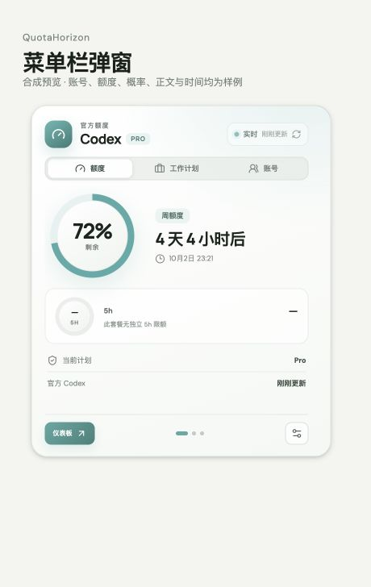
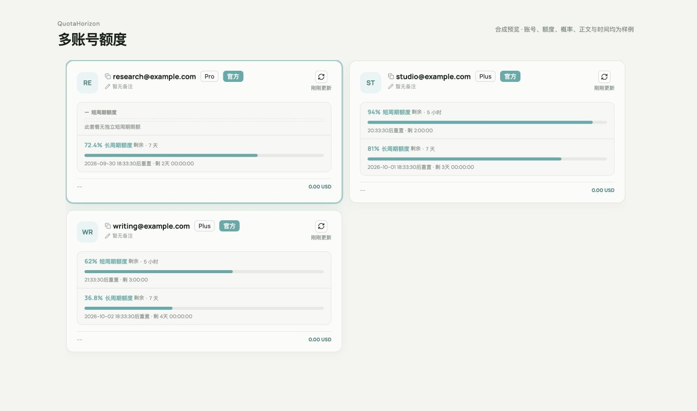
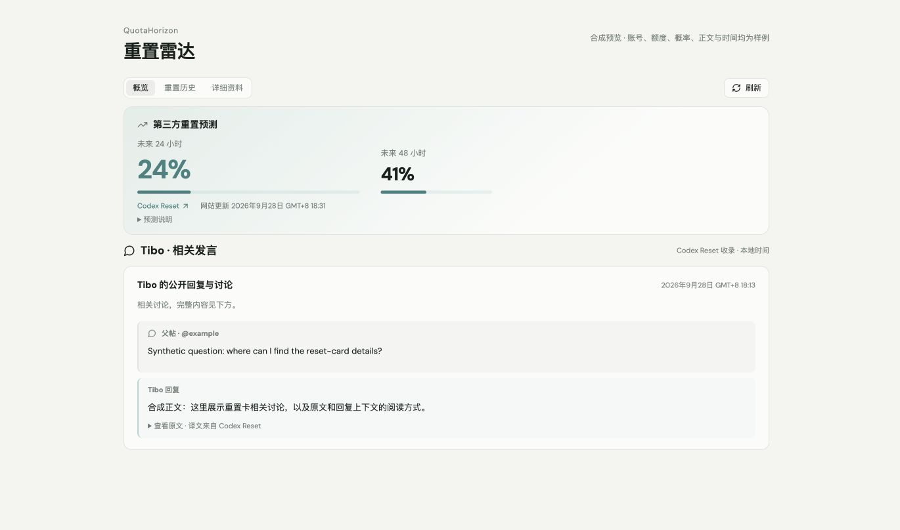
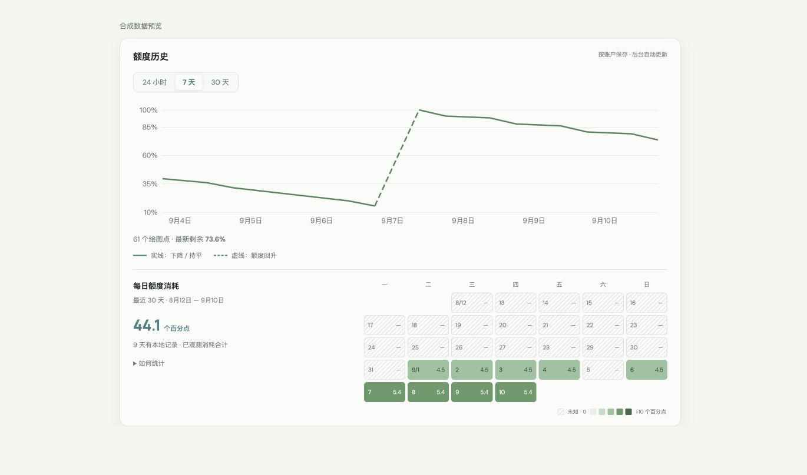

# QuotaHorizon

[简体中文](README.md) · **English**

Check Codex quota from the menu bar and manage accounts, schedules, history and sessions in one window.
QuotaHorizon also collects reset forecasts and related public statements to keep quota and reset information close at hand.

## Download and install

[**Download for macOS**](https://github.com/QuotaHorizon/Quota-Horizon/releases) · [Installation help](docs/INSTALLATION.en.md)

For Apple Silicon (M-series) Macs running macOS 13 or later.

1. Download the macOS Apple Silicon `.dmg` installer from Releases.
2. Open the DMG and drag `QuotaHorizon.app` into Applications.
3. Open QuotaHorizon from Applications and follow the prompt to connect your signed-in local Codex installation.

## Features

- **Menu-bar monitoring**: background refresh, remaining quota and reset times; monitoring continues after the window closes.
- **Account overview**: compare quota, plans and refresh status, and switch the active login when needed.
- **Quota history**: trends and an activity heatmap, with dashed lines for quota increases.
- **Work schedules**: set working and unavailable hours to allocate remaining quota across days.
- **Session management**: search, read, resume, archive, restore and repair sessions.
- **Reset radar**: source websites' 24/48-hour forecasts, Tibo posts, reply context and an event calendar.
- **Providers and CPA**: manage API connections and connect a configured CPA quota pool.

## Interface

These previews use actual product components with synthetic data.

**Menu-bar popover**: quota, reset countdowns and access to accounts.

**Account overview**: quota, plan type and reset times for each account.

**Reset radar**: source probabilities, related posts and reply context.

**Quota history**: usage trends and an activity heatmap.

[View the dark interface](docs/images/history-dark.png)

## Data and settings

Accounts, history and sessions are stored locally. Reset radar automatically collects public information and displays source names and update times.

[Configuration](docs/CONFIGURATION.en.md) · [Reset radar](docs/CONFIGURATION.en.md#reset-radar) · [Updates and history access](docs/INSTALLATION.en.md#update)

## Build from source

See the [development guide](docs/DEVELOPMENT.en.md) for local setup, installer builds and tests.

## Open source

QuotaHorizon builds on Codex Switch `v1.3.5` and is an open-source project independent of OpenAI.
Licensed under [Apache-2.0](LICENSE). See [NOTICE](NOTICE) and [UPSTREAM.md](UPSTREAM.md) for attribution and changes.
